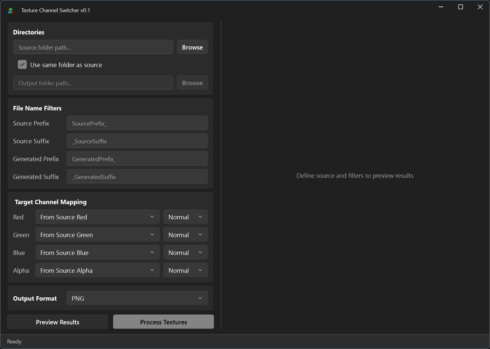

# Texture Channel Switcher

A batch texture channel swithcing tool for Windows. Use this to shuffle, invert, and repack texture channels (Red, Green, Blue, Alpha) from multiple images into new texture maps efficiently. This is just a nice fancy GUI wrapper for ImageMagick CLI to easily filter and batch process images.



## How to use
1. Download from the [Releases](https://github.com/psmyles/TextureChannelSwitcher/releases) section.
2.  **Select Directories:** Choose your source folder containing original textures and an output folder.
3.  **Set Filters:**
    * *Source Prefix/Suffix:* Define what part of the filename to look for (e.g., Suffix: `_ORM`).
    * *Generated Prefix/Suffix:* Define how the new files should be named (e.g., Suffix: `_Packed`).
    * *Note:* You must enter at least one filter to see results.
4.  **Map Channels:**
    * Use the dropdowns to decide what goes into the **Red**, **Green**, **Blue**, and **Alpha** channels of the new image.
    * Options include: Source R/G/B/A, Inverted Source, White, or Black.
5.  **Preview & Process:**
    * Click **Preview Results** to verify the file list.
    * Click **Process Textures** to start the batch operation.

## Resources used

**Image Engine:** [Magick.NET](https://github.com/dlemstra/Magick.NET)

**UI Library:** [WPF-UI](https://github.com/lepoco/wpfui)


## Build instructions

### Prerequisites
[.NET 9.0 SDK](https://dotnet.microsoft.com/download/dotnet/9.0)

### Steps to build
1.  Clone the repository
2.  Restore dependencies:
    ```bash
    dotnet restore
    ```
3.  Run the following command to publish a single file executable:
    ```powershell
    dotnet publish -c Release -r win-x64 --self-contained true -p:PublishSingleFile=true -p:EnableCompressionInSingleFile=true -p:PublishReadyToRun=false -p:IncludeNativeLibrariesForSelfExtract=true
    ```
4.  Navigate to `bin\Release\net9.0-windows\win-x64\publish\` and run `TextureChannelSwitcher.exe`.

## License
Distributed under the MIT License.
